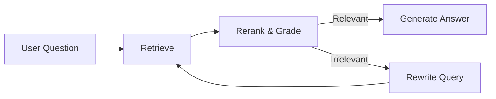

# Project Pitch: Agentic RAG Research Assistant

## 1. Executive Summary
**The "Elevator Pitch"**  
We have built an intelligent **Agentic Research Assistant** that transforms how we interact with complex documents. Unlike standard chatbots that hallucinate or simple search tools that miss context, our system uses an **autonomous agentic workflow** to retrieve, evaluate, and synthesize information from your specific PDF documents. It doesn't just answer; it *researches*, *verifies*, and *cites* its sources, ensuring 100% grounded and accurate responses.

## 2. The Problem
*   **Information Overload**: Professionals spend hours manually sifting through hundreds of pages of PDFs (research papers, contracts, technical manuals) to find specific answers.
*   **Hallucinations in Generic LLMs**: Tools like standard ChatGPT are powerful but **unreliable** for specific tasks. They do not know our internal documents and often confidently invent facts ("hallucinate").
*   **Inefficient Search**: Traditional keyword search ("Ctrl+F") is brittle. It misses synonyms, context, and implied meaning, leading to missed insights.

## 3. The Solution: Agentic RAG
We have developed a **Retrieval-Augmented Generation (RAG)** system powered by **LangGraph**. It acts as a "smart analyst" that follows a rigorous research process:

1.  **Retrieve**: It searches your document knowledge base using semantic understanding, not just keywords.
2.  **Rerank & Grade**: It doesn't trust blindly. It **evaluates** every retrieved text chunk for relevance. If a chunk is irrelevant, it discards it.
3.  **Self-Correct**: If the initial search yields poor results, the agent **rewrites the query automatically** to find better terms and tries again.
4.  **Synthesize & Cite**: It generates a final answer that explicitly cites the source file for every claim.

## 4. Key Features & Benefits
| Feature | Benefit |
| :--- | :--- |
| **Self-Correction** | If the agent can't find an answer, it *tries again* with a better query, mimicking human research behavior. |
| **Hallucination-Free** | The system is constrained to *only* use the provided documents. If the answer isn't there, it says so. |
| **Precise Citations** | Every answer includes `[Source: document.pdf]` citations, allowing users to verify facts instantly. |
| **Local Privacy** | Document embeddings are generated **locally** on-device using HuggingFace models, enhancing data privacy and reducing costs. |
| **OCR Support (New)** | Automatically detects and extracts text from **scanned PDFs and images** using Tesseract, ensuring no data is missed. |
| **Visual Citations (New)** | Displays the **actual PDF page image** alongside the answer, allowing users to see charts, graphs, and diagrams in their original context. |
| **Modern UI** | A clean, responsive web interface built with **Streamlit** makes it accessible to non-technical users. |

## 5. Technical Architecture
Our tech stack is chosen for performance, scalability, and modern best practices:

*   **Frontend**: `Streamlit` (Python-based interactive UI).
*   **Orchestration**: `LangGraph` (State-of-the-art framework for building cyclic, stateful agents).
*   **Vector Database**: `ChromaDB` (Robust, persistent vector store for semantic search).
*   **LLM Intelligence**: `OpenAI GPT-4o` (Leading model for reasoning and synthesis).
*   **Embeddings**: `sentence-transformers/all-MiniLM-L6-v2` (High-performance local embeddings).

### The "Agent Loop" Workflow

## 6. Use Cases
*   **Academic Research**: Quickly synthesizing findings from dozens of papers without reading every word.
*   **Legal & Compliance**: Verifying if contracts meet specific regulatory clauses across a large repository.
*   **Technical Support**: Answering complex troubleshooting questions based on extensive product manuals.

## 7. Development Roadmap
*   **Phase 1: Core Agentic RAG** (Completed): Robust document retrieval, grading, and self-correction loop.
*   **Phase 2: OCR Integration** (Active): Added support for processing scanned PDFs and extracting text from images using Tesseract.
*   **Phase 3: Visual Intelligence**: Planned upgrade to use Multimodal LLMs for interpreting complex charts and graphs directly.
*   **Phase 4: Enterprise Deployment**: Dockerizing the application for cloud deployment (AWS/Azure) with user authentication.

---

## Appendix: Demo Script (How to Present)

**Setup:**
1.  Ensure you have run `python ingest.py` to index the PDFs in the `data/` folder.
2.  Run the app: `streamlit run app.py`.

**Step 1: The "Grounded" Answer**
*   **Action**: Ask a specific question about a paper, e.g., *"What is the methodology used in [Specific Paper Name]?"* or *"Summarize the key findings on [Topic]."*
*   **Highlight**: Show the answer and point out the `[Source: filename.pdf]` citations. Click "Sources used" to show the verification.

**Step 2: The "Smart" Search (Self-Correction)**
*   **Action**: Ask a vague or tricky question that requires context gathering, e.g., *"How does this approach compare to previous methods?"*
*   **Highlight**: Explain that the agent is "thinking" (retrieving, grading, and potentially rewriting query) to find the best answer.

**Step 3: The "Hallucination Check"**
*   **Action**: Ask a question about something *not* in the papers, e.g., *"Who won the 1998 World Cup?"* or *"What does this paper say about [Unrelated Topic]?"*
*   **Outcome**: The bot should reply: *"I don't have enough information in the provided documents..."*
*   **Highlight**: This demonstrates safety and reliability—it doesn't make things up.
